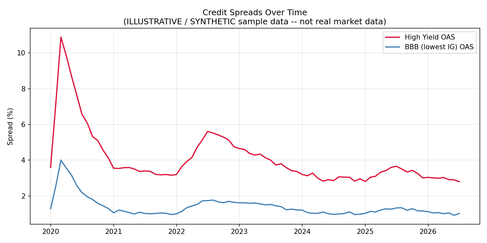

# Credit Spread Dashboard

A Python monitoring tool that tracks corporate credit spreads (High Yield
and BBB OAS) against equity volatility (VIX) and Treasury yields, and
automatically flags historical credit-market stress regimes.



## Overview

Credit spreads — the extra yield investors demand to hold corporate debt
over an equivalent government bond — are one of the most watched signals
on a credit desk. This project pulls **ICE BofA Option-Adjusted Spread
(OAS)** indices via the **FRED API**, builds a visualization pipeline
around them, and layers on a rules-based stress-detection algorithm and a
derived HY–IG quality differential.

## Features

- **Automated data pipeline** — pulls 4 live macro/credit series from the
  FRED API (`BAMLH0A0HYM2`, `BAMLC0A4CBBB`, `DGS10`, `VIXCLS`), with a
  synthetic fallback dataset so the dashboard runs with zero setup.
- **Three-chart visualization suite** — spreads over time, spreads vs.
  equity volatility (VIX), and the HY–IG spread differential — rendered
  with `matplotlib`.
- **Stress-period detection** — a threshold-based rule (HY OAS ≥ 6.0%)
  that automatically identifies and timestamps historical risk-off
  regimes instead of requiring manual chart-reading.
- **HY–IG differential engine** — derives High Yield OAS minus BBB OAS to
  quantify the market's quality-risk premium and its regime shifts.

## Sample output (illustrative data)

Using the bundled illustrative dataset (2020–2026, monthly):

| Metric | Value |
|---|---|
| HY OAS peak | 10.9% (Mar 2020) |
| HY OAS trough | 2.8% (2026) |
| VIX peak | ~60 (Mar 2020) |
| HY–IG differential peak | 6.9% (Mar 2020) |
| HY–IG differential average | 2.7% |
| Secondary stress episode | HY OAS reached 5.6% (mid-2022) |
| Stress periods flagged (≥6.0% threshold) | 1 (Mar–Jun 2020) |

*Note: values above are from the bundled synthetic/illustrative dataset,
built to approximate the shape of real credit cycles for demonstration —
see `data/README_DATA.md`. Run with your own free FRED API key to
reproduce this analysis on the real, licensed ICE Data Indices series.*

## Tech Stack

Python · matplotlib · FRED API (REST/JSON) · pandas-free CSV pipeline ·
time-series analysis · OAS (option-adjusted spread) methodology

## Setup

```bash
pip install -r requirements.txt
python dashboard.py          # runs immediately on illustrative data
```

To use real market data:

```bash
export FRED_API_KEY=your_key_here   # free at https://fredaccount.stlouisfed.org/apikeys
python fetch_data.py
python dashboard.py                 # automatically switches to live data
```

## Files

| File | Purpose |
|---|---|
| `fetch_data.py` | Pulls live HY OAS, BBB OAS, 10Y Treasury, and VIX from the FRED API. |
| `dashboard.py` | Loads live data if available, else the illustrative sample; generates the three charts and runs stress-period detection. |
| `data/credit_spreads_illustrative.csv` | Synthetic sample data so the project runs without an API key. |
| `data/README_DATA.md` | Documents the sample data and licensing/data-source notes. |

## Data Source & License Note

Real HY/BBB OAS series are ICE BofA indices, licensed via FRED for
personal/research use (not redistribution) — hence the synthetic sample
data shipped in this repo. Pulling live data requires your own free FRED
API key.
